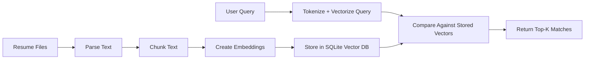

# RAG Resume Query

A beginner-friendly resume retrieval project that follows the core RAG pipeline you described:

`resume -> parsing -> text -> embedding -> vector DB -> retriever -> user query -> compare -> top-k results`

This version focuses on the retrieval backbone of RAG. It parses resumes, chunks the text, converts chunks into TF-IDF embeddings, stores those vectors in a local SQLite-based vector database, and retrieves the most relevant resume sections for a user query.

## What This Project Does

- Upload multiple resumes in `.pdf`, `.docx`, `.txt`, or `.md`
- Extract raw text from each file
- Split the text into overlapping chunks
- Convert chunks into embeddings using `TfidfVectorizer`
- Store chunk vectors and metadata in a local SQLite vector database
- Build a retriever that transforms the user query into the same vector space
- Compare the query vector with stored resume vectors using cosine similarity
- Return the top-k most relevant resume chunks

## Pipeline Overview



## Project Structure

```text
.
|-- app.py
|-- requirements.txt
|-- README.md
|-- src/
|   `-- resume_rag/
|       |-- __init__.py
|       |-- chunking.py
|       |-- config.py
|       |-- embedding.py
|       |-- parsers.py
|       |-- pipeline.py
|       |-- retriever.py
|       |-- schemas.py
|       `-- vector_db.py
`-- tests/
    |-- conftest.py
    |-- test_chunking.py
    `-- test_vector_db.py
```

## How The Retrieval Works

1. The app reads the uploaded resume files and extracts plain text.
2. That text is split into overlapping chunks so we do not lose context between sections.
3. Each chunk is embedded into a numeric vector using TF-IDF.
4. The vectors and chunk metadata are saved into a local SQLite database.
5. When a user asks a question, the same vectorizer transforms the query into a vector.
6. The retriever compares the query vector against all stored chunk vectors using cosine similarity.
7. The app returns the top matches ranked by similarity score.

## Setup

Create and activate a virtual environment:

```powershell
python -m venv .venv
.venv\Scripts\Activate.ps1
```

Install dependencies:

```powershell
pip install -r requirements.txt
```

## Run The App

```powershell
streamlit run app.py
```

Then open the local Streamlit URL shown in the terminal.

## Example Questions

- Which resume has the strongest Python and machine learning experience?
- Find candidates with REST API and backend development skills.
- Show resumes mentioning SQL, dashboards, and analytics.
- Which candidate looks most relevant for a data engineering role?

## How To Push This To GitHub

If you already created a repository on GitHub, use these commands from this folder:

```powershell
git add .
git commit -m "Build RAG resume query project"
git branch -M main
git remote add origin https://github.com/YOUR-USERNAME/YOUR-REPO.git
git push -u origin main
```

If a remote already exists, check it first:

```powershell
git remote -v
```

If needed, update the remote URL:

```powershell
git remote set-url origin https://github.com/YOUR-USERNAME/YOUR-REPO.git
git push -u origin main
```

## Good Next Step

Once you are happy with retrieval quality, the next upgrade is to add a generation layer. That would turn this from retrieval-first RAG into full RAG by sending the top retrieved chunks to an LLM and asking it to synthesize a final answer.

